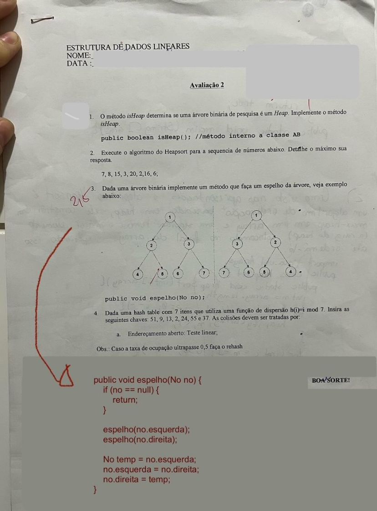

---

### **1. Método `isHeap` para verificar se uma árvore binária é um Heap**
Um Heap é uma **árvore binária completa** onde o nó pai tem um valor menor (min-heap) ou maior (max-heap) que seus filhos. Vamos implementar um método para verificar se uma árvore segue essa propriedade:

```java
public boolean isHeap(No raiz) {
    if (raiz == null) {
        return true;
    }

    if ((raiz.esquerda != null && raiz.esquerda.valor < raiz.valor) ||
        (raiz.direita != null && raiz.direita.valor < raiz.valor)) {
        return false;
    }

    return isHeap(raiz.esquerda) && isHeap(raiz.direita);
}
```

**Explicação:**  
- Se a árvore for vazia (`null`), ela já é um Heap.
- Se um nó tiver um filho com valor menor que ele (violando a propriedade do Heap), retorna `false`.
- Recursivamente verifica se a subárvore esquerda e direita também seguem a propriedade.

---

### **2. Heapsort para a sequência `7, 8, 15, 3, 20, 2, 16, 6`**
O **Heapsort** consiste em construir um heap e depois extrair os elementos ordenados. Vamos ver a execução:

#### **Passo 1: Construir o heap**
A sequência inicial:  
`7, 8, 15, 3, 20, 2, 16, 6`

Transformando em **Max Heap** (maior valor no topo):  

```
       20
      /  \
     15   16
    /  \  /  \
   6    8 2   7
  /
 3
```

#### **Passo 2: Ordenação**
1. Troca `20` com o último (`3`), reduz o heap e reestrutura.  
2. Troca `16` com o último, reduz e reestrutura.  
3. Repete até ordenar.

**Resultado final ordenado:**  
`2, 3, 6, 7, 8, 15, 16, 20`

---

### **3. Método para criar um espelho da árvore**
O código já está na imagem e está correto. Apenas formatado melhor:

```java
public void espelho(No no) {
    if (no == null) {
        return;
    }

    // Primeiro, faz o espelhamento dos filhos
    espelho(no.esquerda);
    espelho(no.direita);

    // Depois, troca os filhos de lugar
    No temp = no.esquerda;
    no.esquerda = no.direita;
    no.direita = temp;
}
```

Esse código percorre a árvore recursivamente e troca os filhos esquerdo e direito de cada nó, criando a versão espelhada.

---

### **4. Inserção na Hash Table com função `h(i) = i mod 7`**
Vamos calcular `i mod 7` para cada valor e inserir na tabela com **endereçamento aberto (teste linear)**.

#### **Passo 1: Calcular `h(i) = i mod 7`**
| Valor | h(i) = i mod 7 |
|--------|---------------|
| 51     | 51 mod 7 = 2  |
| 9      | 9 mod 7 = 2   |
| 13     | 13 mod 7 = 6  |
| 7      | 7 mod 7 = 0   |
| 24     | 24 mod 7 = 3  |
| 55     | 55 mod 7 = 6  |
| 37     | 37 mod 7 = 2  |

#### **Passo 2: Inserção com teste linear**
Se houver colisão, procuramos a próxima posição disponível.

1. `51` → Índice `2`
2. `9` → Índice `2` ocupado → Vai para `3`
3. `13` → Índice `6`
4. `7` → Índice `0`

Ocupou metade. rehash. proximo primo após o dobro do mod. 7*2=14. prox=17.

### Inserir os valores na nova tabela de tamanho 17
Agora, vamos inserir os valores na tabela com 17 posições, seguindo a lógica de resolução de colisões (endereçamento aberto com teste linear).

1. **51** → Índice 0
2. **9** → Índice 9
3. **13** → Índice 13
4. **7** → Índice 7
5. **24** → Índice 7 ocupado → Vai para 8
6. **55** → Índice 4
7. **37** → Índice 3

### Passo 4: Tabela final após o rehash:

| Índice | Valor |
|--------|-------|
| 0      | 51    |
| 1      |       |
| 2      |       |
| 3      | 37    |
| 4      | 55    |
| 5      |       |
| 6      |       |
| 7      | 7     |
| 8      | 24    |
| 9      | 9     |
| 10     |       |
| 11     |       |
| 12     |       |
| 13     | 13    |
| 14     |       |
| 15     |       |
| 16     |       |

Agora, a tabela foi reorganizada após o rehash, com tamanho 17, e todos os valores foram realocados corretamente com base na nova função de hash.